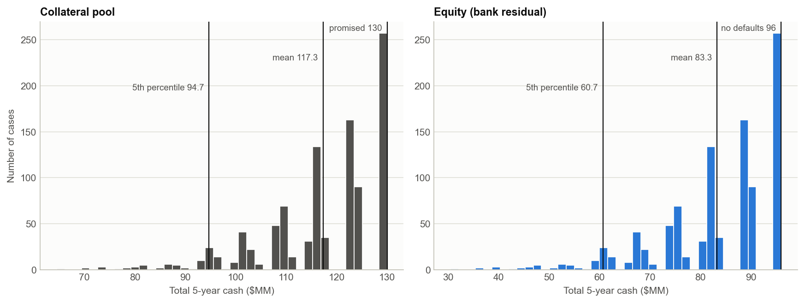

# Miniproject 3 (Part 1) - Simplified CDO Analysis

**FRE 6103 Valuation for Financial Engineering (NYU Tandon)** | Raj Pawar (rsp9234) and Michael Brick (mb11311)

A bank has placed ten 5-year speculative grade bonds in a CDO with two classes of notes and keeps the
residual as equity. This project simulates 1000 cases of correlated default times from a fixed set of
random numbers, turns each case into quarterly cash flows for the 10 bonds with the BIS debt model from
class, and distributes the pooled cash through the waterfall (Class A, then Class B, then equity). It then
describes the cash flows statistically and shows how they respond to the main inputs. The model is
implemented in Python, in Excel and in the browser, and all three give the same numbers. Valuation is Part 2.

**Project page (case viewer, live inputs, downloads):** https://pawarraj8888.github.io/valuation-assignments/cdo-analysis/



## Results at a glance

| | |
|---|---|
| Collateral | 10 bonds, $10 MM face each, 5 years, 6% coupon paid quarterly, 4% annual default probability, LGD 60%, correlation 0.20 |
| Classes | Class A $20 MM at 2%, Class B $10 MM at 4%, quarterly coupons and principal at maturity; equity keeps the residual |
| Simulation | 1000 cases x 10 bonds x 20 quarters from fixed random numbers (seed 6103), de-meaned and moment matched, cases numbered 1 to 1000 |
| Defaults | 1.82 bonds per case on average (theory 1.85); no default at all in 25.7% of cases |
| Pool cash | $117.3 MM on average of the $130 MM promised (standard error $0.4 MM); 5th percentile $94.7 MM; worst case $64.5 MM |
| Class A and Class B | paid in full in every case: even if all 10 bonds default in quarter 1 the pool pays $40.6 MM at maturity and the classes need $30.2 MM |
| Equity cash | $83.3 MM on average of $96 MM; 5th percentile $60.7 MM; worst case $30.5 MM (case 760, 9 defaults) |
| When the classes become risky | only above an LGD of 70.2% (Class B) or 80.2% (Class A); at LGD 100% Class B is short in 0.6% of cases (0.5% exactly under the model) |
| Room in the structure | Class B could be about $20.3 MM instead of $10 MM and still be fully covered by recoveries alone |

All amounts are undiscounted totals over the 20 quarters. The write-up is in
[`writeup/`](writeup/Miniproject3_CDO_Analysis_Report.pdf): assumptions, steps, results, probability
distributions, sensitivities, and appendices with the quarterly table and a worked case.

## Repository layout

```
data/       fixed_random_numbers.csv            1000 x 10 independent standard normals, the only randomness used
python/     cdo/                                package: bonds.py, defaults.py, waterfall.py, model.py, analysis.py,
                                                random_numbers.py, report.py
            run_analysis.py                     full pipeline -> output/ (results.json, CSV tables, figures)
            build_notebook.py                   builds and runs the notebook from the package source
            build_excel.py                      builds the Excel implementation (live formulas, case selector)
            recalc_excel_mac.sh, verify_excel.py    recalculate in Excel (macOS) and prove Excel == Python
            write_report.py, build_site.py      the PDF report and the data for the project page
            tests/                              pytest suite (98 tests)
notebooks/  Miniproject3_CDO_Analysis.ipynb     executed, self-contained walk-through notebook
excel/      Miniproject3_CDO_Analysis.xlsx      Excel implementation
output/     results.json, case_totals.csv, pool_cash_flows.csv, default_quarters.csv, sensitivities.csv,
            moment_matched_random_numbers.csv, figures/
writeup/    Miniproject3_CDO_Analysis_Report.pdf
docs/       GitHub Pages site (index.html, model.js, data.js, files/)
```

## Method in seven lines

1. **Promised cash flows.** Each bond pays 0.15 per quarter and 10.15 in quarter 20; the pool promises 1.5 per
   quarter, 101.5 at maturity, 130 in total.
2. **Fixed random numbers.** 1000 x 10 independent standard normals, drawn once and stored, so every run and
   every sensitivity uses the same numbers.
3. **Moment matching.** As shown in class, the draws are de-meaned and multiplied by the inverse of the Cholesky
   factor of their covariance. Across the 1000 cases each bond's numbers then have mean 0 and variance 1 and are
   uncorrelated with the other bonds' numbers.
4. **Correlated default times.** Cholesky factor of the 10 x 10 matrix with 0.20 off the diagonal, `u = N(x)`,
   then the formula from class `t = ln(1 - u) / ln(1 - pi)` in years. The bond defaults in quarter `ceil(4t)`.
5. **BIS debt model.** `(1 - LGD)` of every promised payment is always paid; the other `LGD` stops in the
   quarter of default. A defaulted bond pays 40% of its coupons and principal on the original dates.
6. **Waterfall.** Each quarter on its own: `A = min(pool, due to A)`, `B = min(pool - A, due to B)`,
   `equity = pool - A - B`. No carry-forwards.
7. **Analysis.** Distributions of total and quarterly cash flows, the distribution of the number of defaults,
   and one-at-a-time sensitivities to the default probability, LGD, correlation and Class B size.

## How the numbers were checked

- The bond function reproduces the BIS example on the Lecture 5 slide: 984.73.
- The simulated mean pool cash flow is within 0.20% of the exact expected value in every quarter.
- The moment matching was built by hand in Excel and separately in Python. The two give the same default
  quarter for all 10,000 bond-cases.
- The standard error column is std dev / sqrt(n), which assumes independent cases. Across 2,000 fresh sets of
  random numbers the mean pool cash varied by $0.15 MM with moment matching and $0.39 MM without, so that
  column is an upper bound on the error of the means.
- The simulated number of defaults is compared with the exact distribution under the model, computed without
  random numbers (one common factor, integrated with Simpson's rule).
- A second implementation with plain loops, written inside the test suite, matches the vectorized model in
  all 1000 cases at the base inputs and at stressed inputs.
- The Excel workbook is recalculated in Excel and compared cell by cell with Python (`verify_excel.py`).
  The largest difference we saw was about 1e-12 (the script's tolerance is 1e-9). The same check passes on
  a workbook built with stressed inputs.
- The JavaScript model behind the project page is run in node by the test suite and matches Python in all
  1000 cases for three sets of inputs; the page repeats that check against the Python totals each time it loads.

## Reproduce

```bash
cd python
python3 -m pip install -r requirements.txt
python3 run_analysis.py                           # output/results.json, CSV tables, figures
python3 build_notebook.py                         # notebooks/Miniproject3_CDO_Analysis.ipynb, executed
python3 build_excel.py                            # excel/Miniproject3_CDO_Analysis.xlsx
./recalc_excel_mac.sh && python3 verify_excel.py  # macOS + Excel: recalculate, then prove Excel == Python
python3 write_report.py                           # writeup/Miniproject3_CDO_Analysis_Report.pdf
python3 build_site.py                             # docs/data.js + copies of the downloads
python3 -m pytest -q tests                        # the JavaScript tests need node, and are skipped without it
```

To look at one case: set `CASE` in section 7 of the notebook, type a case number in the yellow cell on the
`Case` sheet of the workbook, or use the case box on the project page.

## Excel implementation

`excel/Miniproject3_CDO_Analysis.xlsx` re-derives everything from the fixed random numbers with formulas.
Yellow cells are inputs.

| Sheet | Contents |
|---|---|
| `Inputs` | deal parameters and the promised cash flow schedule of a bond, the pool and the two classes |
| `Case` | case selector (1 to 1000): random numbers, default times and quarterly cash flows of the 10 bonds, the pool and the classes, with a chart |
| `Random` | the 1000 x 10 fixed normals stored as values, then the moment matching in formulas: covariance, Cholesky factor, its inverse, the de-meaned table and the matched table |
| `Defaults` | Cholesky factor, correlated normals, uniforms, default times and default quarters for every case |
| `CashFlows` | pool cash flow and the waterfall for every case and quarter, with totals and shortfall flags |
| `Statistics` | summary statistics with the standard error of each mean, default-count distribution, quarterly table and histograms |
| `Sensitivity` | sensitivity tables from the Python run next to the workbook's live values |
| `Notes` | the methodology |

The workbook is generated by `python/build_excel.py` so it stays consistent with the package.

## References

- Shimko, D. C., FRE 6103 Lecture 5 "Events, Corporate Bonds and Securitizations": the BIS defaultable bond
  model and the simulation of default times.
- Li, D. X. (2000), "On Default Correlation: A Copula Function Approach", Journal of Fixed Income 9(4).
- West, G. (2005), "Better Approximations to Cumulative Normal Functions", Wilmott Magazine (the normal CDF
  used on the project page).

## License

Code is MIT licensed. No course files are included in this repository; the lecture's BIS example is used only
as a numerical check on the bond function.
